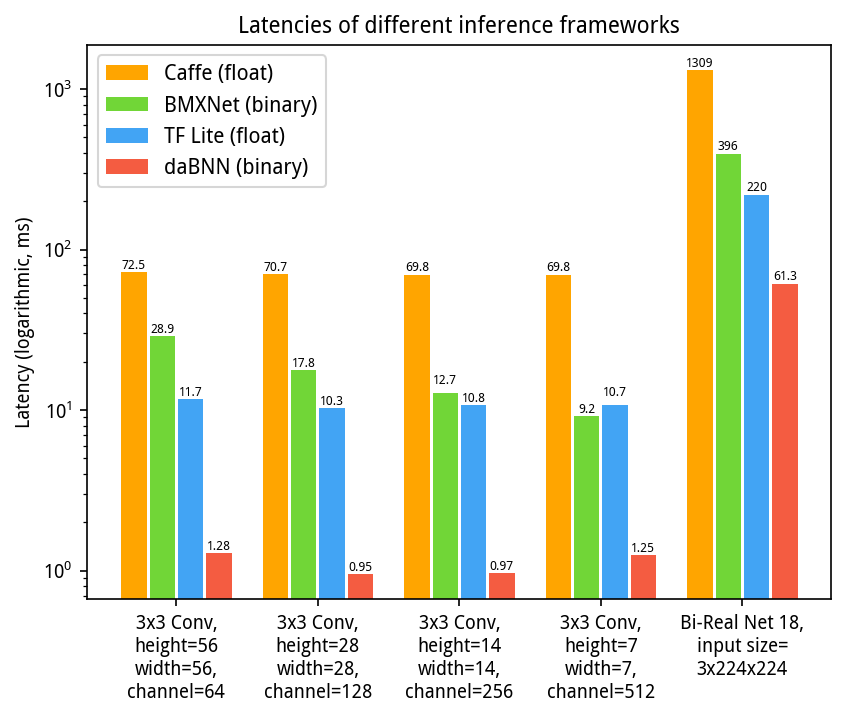

# dabnn

[](https://dev.azure.com/daquexian/dabnn/_build/latest?definitionId=2&branchName=master)
[](LICENSE) 
[](https://github.com/JDAI-CV/dabnn/pulls)

*Enjoy binary neural networks on mobile!*

[English](README.md) [中文](README_CN.md)

QQ Group (Chinese): 1021964010, answer: nndab

## Introduction

Binary neural networks (BNNs) have great potential on edge devices since they replace float operations by efficient bit-wise operations. However, to leverage the efficiency of bit-wise operations, the reimplmentation of convolution layer and also other layers is needed. 

To our best knowledge, dabnn is the first highly-optimized binary neural networks inference framework for mobile platform. We implemented binary convolutions with armv8 assembly. On Google Pixel 1, our dabnn is as **800%~2400% faster** as [BMXNet](https://github.com/hpi-xnor/BMXNet) (the only one open-sourced BNN inference framework except dabnn to our best knowledge) on a single binary convolution, and as about **700% faster** as it on binarized ResNet-18.

## Benchmark and Comparison

Benchmark result on Google Pixel 1:

```
2019-05-02 18:00:29
Running data/local/tmp/dabnn_benchmark
Run on (4 X 1593.6 MHz CPU s)
***WARNING*** CPU scaling is enabled, the benchmark real time measurements may be noisy and will incur extra overhead.
--------------------------------------------------------------------
Benchmark                             Time           CPU Iterations
--------------------------------------------------------------------
dabnn_5x5_256                   3658193 ns    3636875 ns        192     <--- input: 14*14*256, kernel: 256*5*5*256, output: 14*14*256, padding: 2
dabnn_3x3_64                    1285949 ns    1261826 ns        552     <--- input: 56*56*64,  kernel: 64*3*3*64, output: 56*56*64, padding: 1
dabnn_3x3_128                    988757 ns     981547 ns        721     <--- input: 28*28*128, kernel: 128*3*3*128, output: 28*28*128, padding: 1
dabnn_3x3_256                   1018918 ns    1008007 ns        689     <--- input: 14*14*256, kernel: 256*3*3*256, output: 14*14*256, padding: 1
dabnn_3x3_256_s2                 269234 ns     268085 ns       2613     <--- input: 14*14*256, kernel: 256*3*3*256, output: 7*7*256, padding: 1, stride: 2
dabnn_3x3_512                   1226245 ns    1203749 ns        579     <--- input:  7* 7*512, kernel: 512*3*3*512, output:  7* 7*512, padding: 1
dabnn_bireal18_imagenet        61809506 ns   61056865 ns         10     <--- Bi-Real Net 18, 56.4% top-1 on ImageNet
dabnn_bireal18_imagenet_stem   43279353 ns   41533009 ns         14     <--- Bi-Real Net 18 with stem module (The network structure will be described in detail in the coming paper), 56.4% top-1 on ImageNet
```

The following is the comparison between our dabnn and [Caffe](http://caffe.berkeleyvision.org) (full precision), [TensorFlow Lite](https://www.tensorflow.org/lite) (full precision) and [BMXNet](https://github.com/hpi-xnor/BMXNet) (binary). Note that "Conv 64", "Conv 128", "Conv 256" and "Conv 512" have the same meaning as in the above benchmark. We surprisingly observe that BMXNet is even slower the full precision TensorFlow Lite. It suggests that the potential of binary neural networks is far from exploited until our dabnn is published.



## Example project

Android app demo: https://github.com/JDAI-CV/dabnn-example

## Convert ONNX Model

We provide a conversion tool, named onnx2bnn, to convert an ONNX model to a dabnn model. To get the conversion tool, just build the project using the native toolchain (instead of arm cross-compiling toolchain). For Linux users, we provide pre-built onnx2bnn AppImage. Linux users can download it from [GitHub Releases](https://github.com/JDAI-CV/dabnn/releases). For the usage and other information about AppImage, please check out https://appimage.org .

Note: Even though ONNX has the Sign operator, we haven't supported it for now (It will be supported soon). Please remove the sign operation when exporting the ONNX model. We will automatically find which one is binary convolution according to the weight.

## Pretrained Models

We publish two pretrained binary neural network models based on [Bi-Real Net](https://arxiv.org/abs/1808.00278) on ImageNet. More pretrained models will be published in the future.

* [Bi-Real Net 18](https://drive.google.com/uc?export=download&id=1Oau5CtFR9nWXmlBBU47Jg5ypMiIEMtvo), 56.4% top-1 on ImageNet, 61.8ms/image on Google Pixel 1.

* [Bi-Real Net 18 with Stem Module](https://drive.google.com/uc?export=download&id=1ArsirMdbtJ9lvHSjc1hkQ7dIXDKh-D1t), 56.4% top-1 on ImageNet, 43.2ms/image on Google Pixel 1. The detailed network structure will be described in the coming paper.

## Implementation Details

We plan to participate the [ACM Multimedia 2019 Open Source Software Competition](https://www.acmmm.org/2019/call-for-open-source-software-competition/). Our implementation details will be presented in a 4-page short paper soon.

## License

[BSD 3 Clause](LICENSE)
